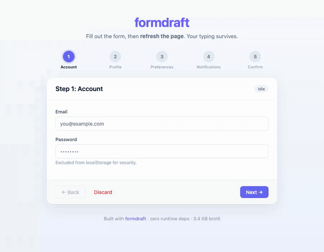

# formdraft

> Production-grade form auto-save + offline survival for React. Zero runtime dependencies.

[](https://www.npmjs.com/package/formdraft)
[](https://bundlephobia.com/package/formdraft)
[](LICENSE)
[](#zero-runtime-dependencies)

> ⚠️ **v0.1.0-rc.2 (release candidate).** Code-complete with 94 unit tests + 21 Playwright e2e tests (Chromium / Firefox / WebKit). Looking for production feedback before v0.1.0 stable. Try it, report bugs at https://github.com/mayrang/formdraft/issues.



When your user fills out a long form, the form survives:
- Page refresh
- Tab close + reopen
- Going offline mid-typing
- Editing the same form in two tabs
- Failed server saves (with retry)

## Install

```bash
npm install formdraft
# peers (you probably already have these):
npm install react react-hook-form zod
```

`react-hook-form` and `zod` are optional peer dependencies. Use only what you need.

## Quick start

```tsx
import { useFormDraft, zodAdapter, localStorageAdapter } from 'formdraft';
import { z } from 'zod';

const Schema = z.object({ name: z.string(), bio: z.string() });

function ProfileForm() {
  const { values, set, status, save, discard, submit } = useFormDraft({
    key: 'profile-form',
    schema: zodAdapter(Schema),
    defaultValues: { name: '', bio: '' },
    sync: async (v) => api.saveProfile(v),
  });

  return (
    <form onSubmit={submit(async (v) => { await api.submitProfile(v); })}>
      <input value={values.name} onChange={(e) => set('name', e.target.value)} />
      <textarea value={values.bio} onChange={(e) => set('bio', e.target.value)} />
      <span>{status}</span>
      <button type="submit">Save</button>
    </form>
  );
}
```

Refresh the page. Your typing survives.

## React Hook Form integration

```tsx
import { useForm } from 'react-hook-form';
import { useFormDraftRHF } from 'formdraft/rhf';

const form = useForm({ defaultValues: { name: '' } });
const { status } = useFormDraftRHF(form, { key: 'rhf-profile', schema: zodAdapter(Schema), sync: api.save });

return <form>{/* form.register, etc. */}<span>{status}</span></form>;
```

## Formik integration

```tsx
import { useFormik } from 'formik';
import { useFormDraftFormik } from 'formdraft/formik';

const formik = useFormik({
  initialValues: { name: '', bio: '' },
  onSubmit: async (values) => {
    await api.submitProfile(values);
    discard(); // ← clears storage + broadcasts to other tabs + resets formik
  },
});

const { status, lastSavedAt, discard } = useFormDraftFormik(formik, {
  key: 'profile-form',
  schema: zodAdapter(Schema),
  sync: api.saveProfile,
});
```

Restore happens once on mount when storage has a valid draft AND the user hasn't started typing (gated on `formik.dirty`); after that, formik is the source of truth and every value change is persisted automatically.

**On successful submit, call `discard()`** to clear the stored draft and broadcast to other tabs. Without this, the draft survives in storage and reappears on next mount even though the user has already submitted it. (RHF users have the same responsibility — formdraft never assumes submit "happened" until the host form library tells us.)

## TanStack Form integration

```tsx
import { useForm } from '@tanstack/react-form';
import { useFormDraftTanstack } from 'formdraft/tanstack-form';

const form = useForm({
  defaultValues: { name: '', bio: '' },
  onSubmit: async ({ value }) => {
    await api.submitProfile(value);
    discard(); // ← clears storage + broadcasts + resets form
  },
});

const { status, lastSavedAt, discard } = useFormDraftTanstack(form, {
  key: 'profile-form',
  schema: zodAdapter(Schema),
  sync: api.saveProfile,
});
```

Restore happens once on mount when storage has a valid draft AND the user hasn't already started typing. Restore calls `setFieldValue` per top-level key with `{ dontValidate: true }` so onChange validators don't paint errors against text the user never typed. (We deliberately do *not* pass `dontUpdateMeta`: TanStack's `FieldApi.update` reseeds any field whose `isTouched` is still `false` back to its `defaultValue` prop on the next render, which would silently wipe restored data on the idiomatic `<form.Field name="x" defaultValue="">`.) As with the Formik adapter, **call `discard()` in your `onSubmit`** after a successful API submit so the just-submitted draft doesn't reappear on next page load.

## What it handles

| Production form pain | formdraft |
|---|---|
| Refresh loses 20 minutes of typing | localStorage persist + mount restore |
| Server save fails silently | retry queue with exponential backoff |
| Offline write then reconnect | `online` + `visibilitychange` flush |
| Captive portal (`onLine=true` but no internet) | pluggable `connectivityProbe` HEAD-checks a known URL before each sync |
| Two tabs editing same draft | BroadcastChannel + `multiTab='warn'` |
| Tab A submits, Tab B keeps stale draft | submit broadcast → all tabs discard |
| Component unmounts mid-sync | guarded; no setState-on-unmounted warnings |
| Password in localStorage | `excludeFields: ['password']` |
| Schema changed between sessions | `version` + `migrate(fn)` |
| Large content (rich text, base64 images) | IndexedDB adapter |
| 4-byte structured-clone class loss | dev-mode warning |

## Why this exists

`react-hook-form-persist`, the market leader at 35k weekly downloads, has been unmaintained since May 2022. `formik-persist` since 2018. No major form library (React Hook Form, Formik, TanStack Form) ships first-party auto-save.

Every SaaS reinvents the same ~700-LOC stack: localStorage persistence + retry queue + multi-tab sync + status indicator + IndexedDB for large drafts. We measured this in calibration before writing a line of library code.

formdraft is that stack, packaged. With the 7 platform-quirk traps AI assistants reliably miss (`navigator.onLine` lies, `BroadcastChannel` structuredClone class loss, mobile Safari tab suspension, sync vs async storage incompat, etc.) baked in as obvious affordances.

## Compared to alternatives

| Library | Status | Persist | Restore | Server sync | Offline queue | Multi-tab | Status UI | IndexedDB | Bundle |
|---|---|---|---|---|---|---|---|---|---|
| **formdraft** | active | ✓ | ✓ | ✓ | ✓ | ✓ | ✓ | ✓ | 3.4 KB |
| react-hook-form-persist | dead 2022 | ✓ | ✓ | — | — | — | — | — | ~2 KB |
| formik-persist | dead 2018 | ✓ | ✓ | — | — | — | — | — | ~2 KB |
| react-autosave | partial | — | — | ✓ | — | — | — | — | ~3 KB |
| workbox-background-sync | active | — | — | ✓ | ✓ (SW) | — | — | — | 12 KB |
| Replicache / Zero | active | full sync engine, very different scope |
| Tiptap collab + Yjs | active | rich-text editor only, not form-shaped |

## Storage adapters

```tsx
import { localStorageAdapter, sessionStorageAdapter, indexedDBAdapter, autoAdapter } from 'formdraft';

useFormDraft({ ..., storage: indexedDBAdapter() });  // for big forms
```

### `autoAdapter` — automatic localStorage → IndexedDB

If you don't know upfront how large a draft will get (rich text editor, base64 image uploads, long markdown), use `autoAdapter`. It writes to localStorage for small payloads, and once a value crosses the size threshold, transparently routes that key to IndexedDB. Existing data is migrated; the stale localStorage entry is cleaned up so reads stay consistent.

```tsx
import { autoAdapter } from 'formdraft';

useFormDraft({
  storage: autoAdapter({
    thresholdBytes: 500_000,  // default 1_000_000 (1 MB)
    onMigration: (key, reason) => {
      console.log(`[formdraft] ${key} migrated to IndexedDB:`, reason);
    },
  }),
  // ...
});
```

It also recovers from `QuotaExceededError` — if another library on the same origin fills localStorage and our write fails, autoAdapter falls back to IndexedDB transparently (and fires `onMigration` with `reason: 'quota'`).

Notes:
- `thresholdBytes` is compared against `JSON.stringify(value).length`, i.e. UTF-16 code units; multi-byte chars (Korean, emoji) under-count by ~2× vs. real on-wire bytes. The 1 MB default leaves plenty of headroom for this.
- Strict inequality: a payload of exactly `thresholdBytes` stays in primary. Cross it (`>`) to trigger migration.
- After a key migrates to IndexedDB, reads become async (~10-50ms typical) instead of synchronous localStorage. Negligible for mount-restore but worth noting for very latency-sensitive flows.
- `primary` and `fallback` MUST be distinct adapter instances; the constructor throws otherwise.
- If a migration's `primary.remove` fails (rare; usually means storage was disabled mid-session), the stale localStorage entry remains and reads return the old value until the next successful `write()` or `remove()` resolves it. `onMigration` is suppressed in this case so telemetry doesn't lie.
- Concurrent `read()` + `clear()` ordering is undefined: a read started before clear may still resolve with pre-clear data. Sequence them in caller code if you need strict happens-before.

## Reliable online detection

`navigator.onLine === true` lies on captive portals (hotel/airport/coffee shop WiFi) and partially-online states (airplane mode disabled but data blocked). formdraft offers two ways to handle this:

### Option 1: per-sync probe (cheap, one-shot)

```tsx
useFormDraft({
  // ...
  connectivityProbe: () =>
    fetch('/api/ping', { method: 'HEAD' })
      .then((r) => r.ok)
      .catch(() => false),
});
```

Called before each sync attempt. Falsy/throwing → defer (not counted as a failed retry). Retries on the next `online`/`visibilitychange` event or when `save()` is called.

Use when sync attempts are rare and you want minimal overhead.

### Option 2: heartbeat detector (cached, background)

```tsx
import { createHeartbeatDetector, useFormDraft } from 'formdraft';

const detector = createHeartbeatDetector({
  url: '/api/health',     // HEAD-able URL
  intervalMs: 30_000,     // default 30s
  timeoutMs: 5_000,       // default 5s
});

function MyForm() {
  useFormDraft({
    // ...
    onlineDetector: detector,
  });
  // ...
}

// On app shutdown:
// detector.destroy();
```

The detector pings in the background, caches the result, and is consulted **synchronously** by the sync queue (zero added latency per sync). Online transitions also wake any pending retry immediately — no polling required. While the tab is hidden it stops scheduling new pings (saves battery, no service-worker wakeups); any ping that was already in flight and the browser's own `online`/`offline` events still update state. It re-probes on `online`, flips offline instantly on `offline`, and treats any received HTTP response as reachable (so a 500 doesn't get mis-flagged as a network outage).

**Worst-case staleness**: if the URL hangs indefinitely (server slow, no response), the detector keeps the previous state until `timeoutMs` aborts the request (default 5s), then flips offline. Don't point the URL at an endpoint served by your service worker's offline cache — a cached 200 will make the detector lie during real outages.

Use when many sync attempts happen and you don't want fetch latency on each.

**Stacking both** is supported — the detector gates the queue's first attempt; the probe runs per individual attempt.

## Custom storage adapter

```tsx
const customAdapter: StorageAdapter = {
  name: 'custom',
  async read(key) { /* ... */ },
  async write(key, value) { /* ... */ },
  async remove(key) { /* ... */ },
};
```

## Reading status from anywhere in the tree

You don't always want to drill the `draft` object down to a deep child just to render a "Saving…" pill in a corner. Subscribe to any active `useFormDraft` instance by its `key`:

```tsx
import { useFormDraftStatus } from 'formdraft';

function SavingIndicator() {
  const { status, lastSavedAt } = useFormDraftStatus('profile-form');
  return <span>{status === 'saved' ? `Saved ${lastSavedAt?.toLocaleTimeString()}` : status}</span>;
}
```

Backed by `useSyncExternalStore`; SSR-safe (renders `idle` on the server).

## Multi-tab strategies

| Strategy | What happens on remote change |
|---|---|
| `'warn'` (default) | Sets `status='conflict'`; you call `resolveConflict('local' \| 'remote' \| merged)` |
| `'last-writer-wins'` | Adopts remote silently; fires `onConflict` if provided |
| `'manual'` | Fires `onConflict`, library does nothing automatic |
| `false` | Disables multi-tab (no BroadcastChannel overhead) |

## Zero runtime dependencies

formdraft has **no** runtime dependencies. Only peer deps (which you'd install anyway): `react`, optionally `react-hook-form`, optionally `zod`.

Bundle target: **≤ 8 KB gzipped** (enforced in CI).

## Security model

formdraft trusts **same-origin code**. Concretely:

- Any script on the same origin (your app, browser extensions installed by the user, XSS payloads if your app has them) can call `localStorage.setItem('formdraft:<key>', ...)` or open a `BroadcastChannel('formdraft:<key>')` and post a `discarded` / `submitted` / `values-changed` message. The library will treat such a message as if it came from another legitimate tab and may clear the draft or update values accordingly.
- This is intentional — multi-tab coordination on the same origin is the headline feature. Cross-origin BroadcastChannels are already impossible per the web platform.
- Stored data goes through your schema (`zod` or compatible) on restore. Malicious JSON with unknown keys or wrong types is discarded; **prototype pollution attacks via `__proto__` keys are neutralized** by the schema parse step. If you replace Zod with a less strict validator, you take on that responsibility.

Threats out of scope for v0.1:
- Cryptographically signing messages between tabs (e.g., HMAC) — would require key distribution; not worth the complexity for the same-origin trust boundary.
- Rate-limiting hostile broadcast spam.

If your app must defend against malicious same-origin code (e.g., third-party scripts you don't fully trust), don't use formdraft for sensitive drafts on those pages.

## What this lib is NOT

- Not a form-state manager. Use React Hook Form (or anything else) for that; formdraft wraps your form state with persistence.
- Not a sync engine. Bring your own backend; formdraft calls your `sync(values)` function.
- Not a CRDT. Conflicts are last-writer-wins + warning by default.
- Not React Native compatible. Browser APIs only.

## Migration

- From `react-hook-form-persist`: see [docs/migration-from-react-hook-form-persist.md](docs/migration-from-react-hook-form-persist.md).

## Contributing

PRs welcome. Especially:
- Vue / Svelte / Solid adapters (architecture is framework-agnostic at the core; bindings live in `src/<framework>/`)
- Formik / TanStack Form / Felte adapters
- Network heartbeat plugin (`navigator.onLine` is unreliable)
- Real-world bug reports with reproduction

Local development:
```bash
git clone https://github.com/mayrang/formdraft
cd formdraft
npm install
npm test
npm run build
```

## FAQ

**Q: Why does my form lose data on first refresh?**
A: Restore is asynchronous. The hook reads storage in a `useEffect`. The default values render first, then values restore on the next paint. To force-show a loading state while restoring, check `pendingChanges === false && values === defaultValues` for the first ~50ms.

**Q: Can I use this with TanStack Form / Formik?**
A: Use the headless `useFormDraft` and wire your form lib's values into it via the form lib's watch API. The RHF adapter is a thin convenience wrapper. PRs for Formik / TanStack Form adapters welcome (target `formdraft/<adapter>` subpath).

**Q: My form has 100+ fields and IndexedDB feels slow.**
A: localStorage handles up to ~5 MB synchronously; IndexedDB is recommended for forms with large binary content (base64 images, long markdown). Pure text forms should stay on localStorage.

**Q: Does this work with Next.js App Router / SSR?**
A: Yes. The hook does nothing during SSR (no storage reads on server). On client mount it restores. Set `disabled={true}` if you need to skip even client-side restore (e.g., for privacy-mode pages).

Put `useFormDraft` inside a Client Component (file starting with `'use client'`). Server Components can then import that Client Component normally:

```tsx
// app/profile/ProfileForm.tsx
'use client';
import { useFormDraft, zodAdapter, localStorageAdapter } from 'formdraft';
// ...

// app/profile/page.tsx (Server Component — no 'use client')
import { ProfileForm } from './ProfileForm';
export default function Page() { return <ProfileForm />; }
```

Verified end-to-end against Next.js 14 App Router: no SSR crash, no hydration mismatch, `disabled={true}` short-circuits client-side restore.

**Q: How is this different from Zustand persist or redux-persist?**
A: Those are generic state-persistence libraries — they handle persist + restore but not the rest: server sync, offline queue, multi-tab conflict, status UI, schema migration, sensitive-field exclusion. You can combine them with workbox-background-sync but you reinvent ~700 LOC of glue per app. formdraft is that glue, packaged.

**Q: What about React Native?**
A: No. formdraft uses BroadcastChannel, navigator.onLine, IndexedDB — all browser APIs. RN port would need entirely different storage + sync layer. Out of scope for v0.1.

## Status

- **v0.1.0-rc.1** on [npm](https://www.npmjs.com/package/formdraft) (RC — looking for production feedback)
- 94 unit tests + 21 Playwright e2e (7 headline scenarios × Chromium / Firefox / WebKit)
- **~3.85 KB brotli** (8 KB CI gate)
- React 18+; Browser support Chrome/Edge 88+, Firefox 78+, Safari 15.4+
- WebKit (iOS Safari engine): persist, restore, discard race, offline queue, submit broadcast all verified e2e
- 0 runtime dependencies

## License

MIT
